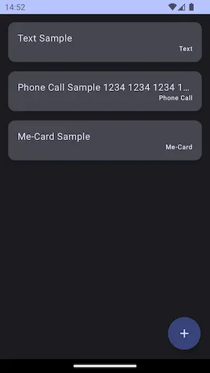
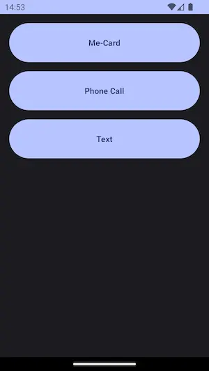
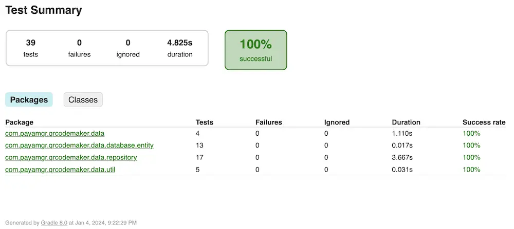
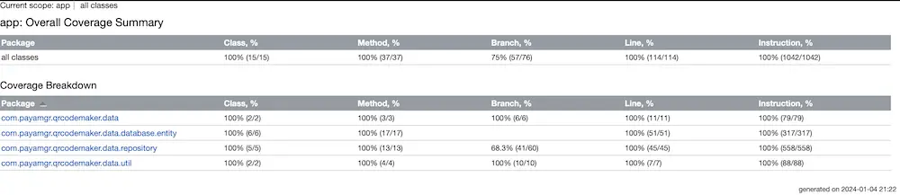
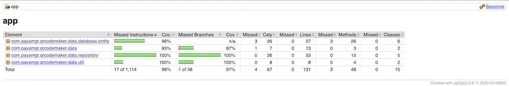

# QR-Code Maker Android App
It makes QR-Code based on casual users contents.

Currently supports:
- Raw Text
- Phone Call
- Me-Card

## Preview
### Home

### Content Type

### Me-Card Form

### Show QR-Code

## Code Quality
### Test Results
- Unit Test

### Test Coverage
- Kover

- Jacoco

