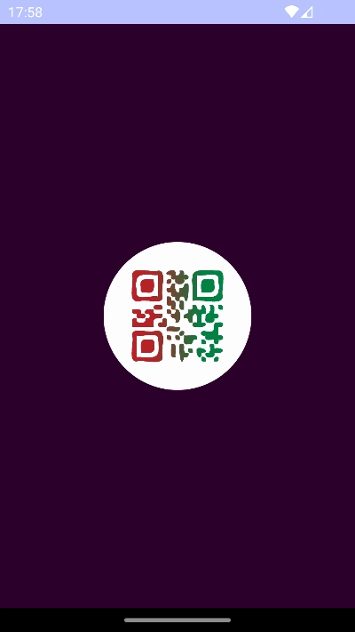
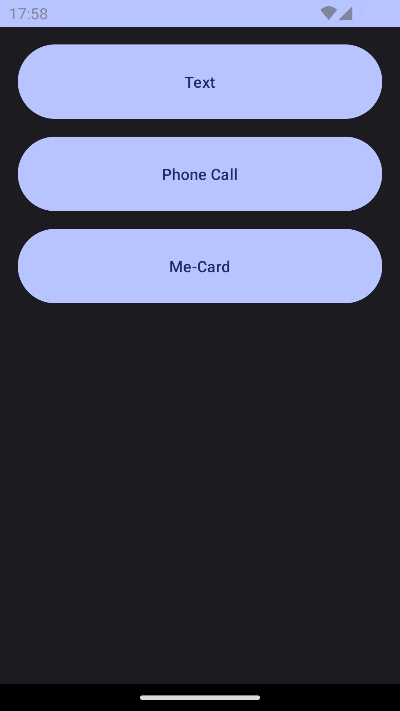
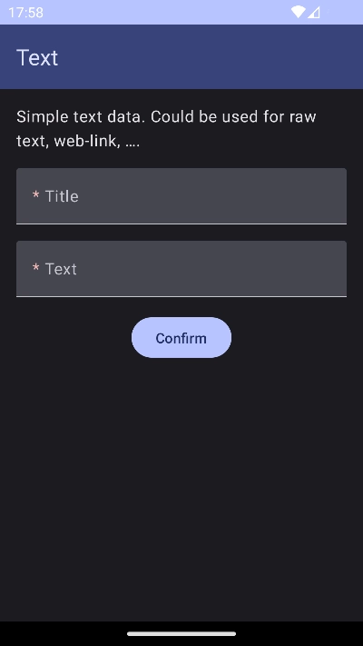
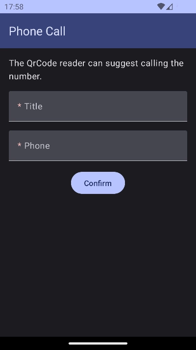
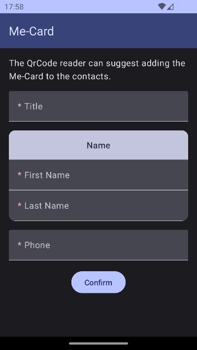
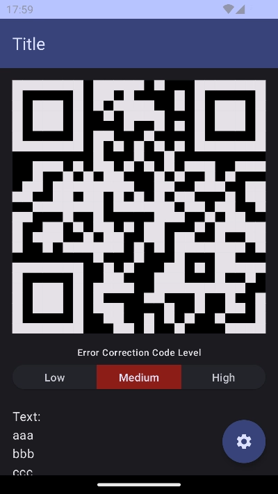
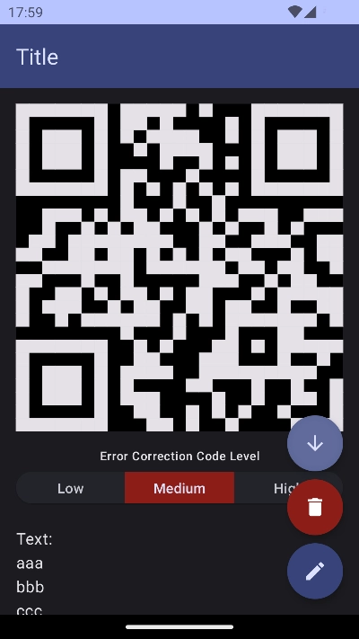
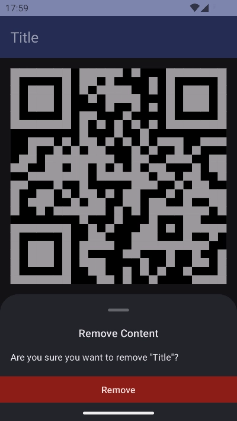
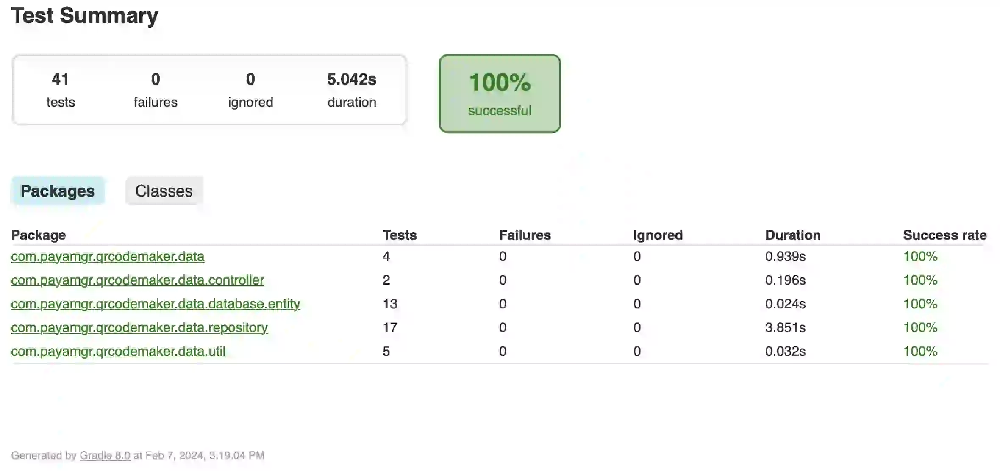

# QR-Code Maker Android App
It makes QR-Code images based on casual user contents, targeted for cell-phone usecases.

## Supported Content Types (Currently)
- Raw Text
- Phone Call
- Me-Card

# Screenshots
The screenshots are automatically captured, resized and compressed from the instrumented testes.

## Splashscreen


## Home


## Content Type


## Content Form
### Insert Mode




### Edit Mode


## Show QR-Code
### Portrait





### Landscape


# Code Quality
## Test Results ✅
### Unit Tests 

### UI Tests 


## Test Coverage 👍
### Kover Report 

### Jacoco Report 


# Scripts
Some Unix scripts to make the external source management and screenshot capturing automatic.
Run the scripts from the project root directory.

## `download-install-qrcode-cpp.sh`
It downloads the [QRCodeMaker-cpp](https://github.com/PayamGerackoohi/QRCodeMaker-cpp/) github project and installs it on the `./app/src/main/cpp/qrcode-lib` directory. It provides the core functionality of the app.

```sh
./scripts/download-install-qrcode-cpp.sh
```

## `take-screenshots.sh`
<!-- - Edit `adb` and `JAVA_HOME` in the script to the  -->
For the first time, set your `adb` and `JAVA_HOME` for `jdk-17` into the `env` file. Similar this on OSX:
```sh
rm -f scripts/env
echo 'adb=/Users/payam1991gr/Library/Android/sdk/platform-tools/adb' >> scripts/env
echo 'JAVA_HOME=/Applications/Android Studio.app/Contents/jbr/Contents/Home' >> scripts/env
```

From now on
- Run an android emulator device 
- Run the script
```sh
./scripts/take-screenshots.sh
```
The results are stored in the `./docs/screenshots` directory.

❌ Don't put anything inside the `./docs/screenshots` folder. It would be cleaned-up everytime you call the `take-screenshots.sh` script.

# TODO
- [ ] Placing image inside the QR-Code
- [ ] More content types
